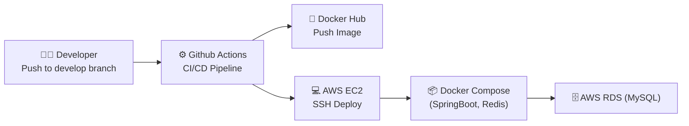

# 🚀 CI/CD 배포 튜닝 프로젝트

  
  
  
  
  

---

## 📚 목차
1. [프로젝트 소개](#-프로젝트-소개)  
2. [아키텍처](#-아키텍처)  
3. [튜닝 포인트](#-튜닝-포인트)  
4. [CI/CD 파이프라인](#-cicd-파이프라인)  
5. [배포 과정](#-배포-과정)  
6. [개선 효과](#-개선-효과)  

---

## 🌱 프로젝트 소개
Spring Boot 애플리케이션을 **AWS EC2 + Docker + Github Actions** 기반으로 자동 배포하도록 구성하고,  
CI/CD 파이프라인을 **튜닝하여 빌드 속도 단축 및 보안 강화**를 목표로 한 프로젝트입니다.  

---

## 🏗 아키텍처

---

# ⚡ 주요 튜닝 포인트

- ⚡ **Gradle 캐시 적용** → 빌드 시간 단축  
- 🔐 **application.yml Secrets 관리** → 보안 강화  
- 🔄 **무중단 배포(docker-compose restart)** → 다운타임 최소화  
- 🧹 **Docker Image Prune 자동화** → 서버 디스크 최적화  
- 🔒 **EC2 ↔ RDS 최소 권한 보안 그룹 적용**  

---

# 🎯 개선 목표

1. **배포 자동화**  
   - Github Actions 기반 파이프라인으로 수동 배포 과정을 제거하고, 안정적인 자동 배포 환경 구현  

2. **성능 최적화**  
   - 캐시 활용 및 불필요한 리소스 제거를 통해 빌드 및 배포 속도 단축  

3. **보안 강화**  
   - 민감한 설정(application.yml)을 Secrets로 관리하고, 최소 권한 원칙 기반의 보안 그룹 적용  

4. **가용성 확보**  
   - 무중단 배포 전략을 통해 서비스 다운타임 최소화 및 안정적인 서비스 제공  

5. **운영 효율화**  
   - Docker 이미지 관리 자동화로 서버 디스크 공간 최적화 및 운영 관리 편의성 향상  
