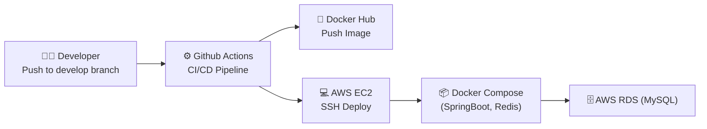

# 🚀 CI/CD 배포 튜닝 프로젝트

  
  
  
  
  

---

## 📚 목차
1. [프로젝트 소개](#-프로젝트-소개)  
2. [아키텍처](#-아키텍처)  
3. [튜닝 포인트](#-튜닝-포인트)  
4. [CI/CD 파이프라인](#-cicd-파이프라인)  
5. [배포 과정](#-배포-과정)  
6. [개선 효과](#-개선-효과)  

---

## 🌱 프로젝트 소개
Spring Boot 애플리케이션을 **AWS EC2 + Docker + Github Actions** 기반으로 자동 배포하도록 구성하고,  
CI/CD 파이프라인을 **튜닝하여 빌드 속도 단축 및 보안 강화**를 목표로 한 프로젝트입니다.  

---

## 🏗 아키텍처

